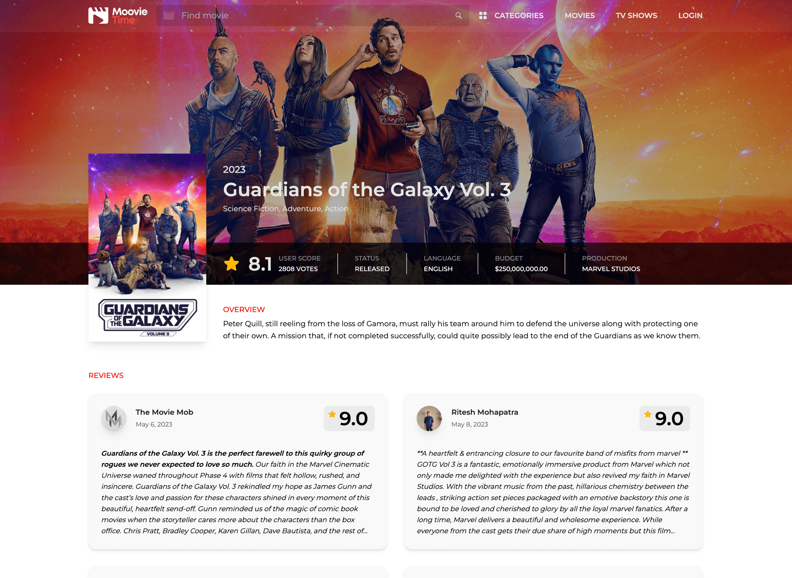
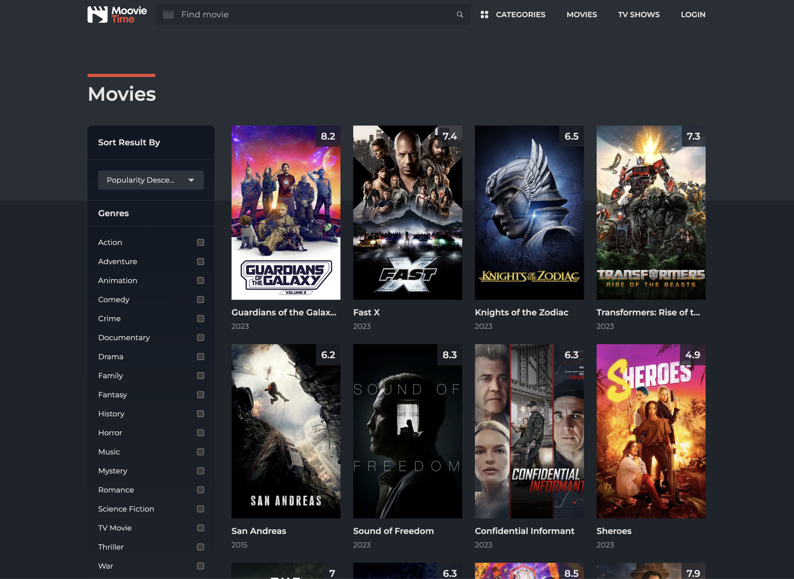
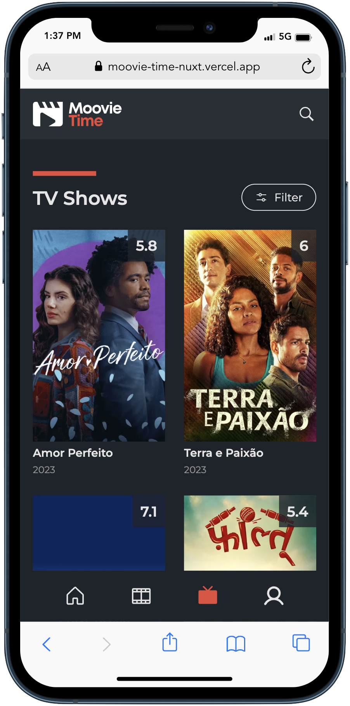

<p align="center">

</p>

<h1 align="center">
Moovie Time
</h1>

<p align="center">
Moovie Time is a web application that allows you to search for movies and series, and see their details.
</p>


**🍿 Live preview:** https://moovie-time-nuxt.vercel.app

## Modules Used

- [VueUse](https://github.com/vueuse/vueuse) - collection of useful composition APIs.
- [UnoCSS](https://github.com/unocss/unocss) - the instant on-demand atomic CSS engine.
- [VitePWA](https://github.com/vite-pwa/nuxt) - zero-config PWA Plugin for Nuxt 3.
- [DevTools](https://github.com/nuxt/devtools) - unleash Nuxt Developer Experience.
- [NuxtImage](https://image.nuxtjs.org/) - automatically optimizes images used in Nuxt projects (JPEG, PNG, SVG, WebP and GIF).
- [NuxtSwiper](https://github.com/cpreston321/nuxt-swiper) - NuxtJS module for [Swiper](https://swiperjs.com/).

## Screenshots

<br><br>
<br><br>
<br><br>



## Setup

``` bash
# Enable pnpm
$ corepack enable

# Install dependencies
$ pnpm install

# Start dev server with hot reload at localhost:3000
$ pnpm dev
```

## Credits


Data provided by [The Movie Database](https://www.themoviedb.org).

This project uses the TMDB API but is not endorsed or certified by TMDB.
